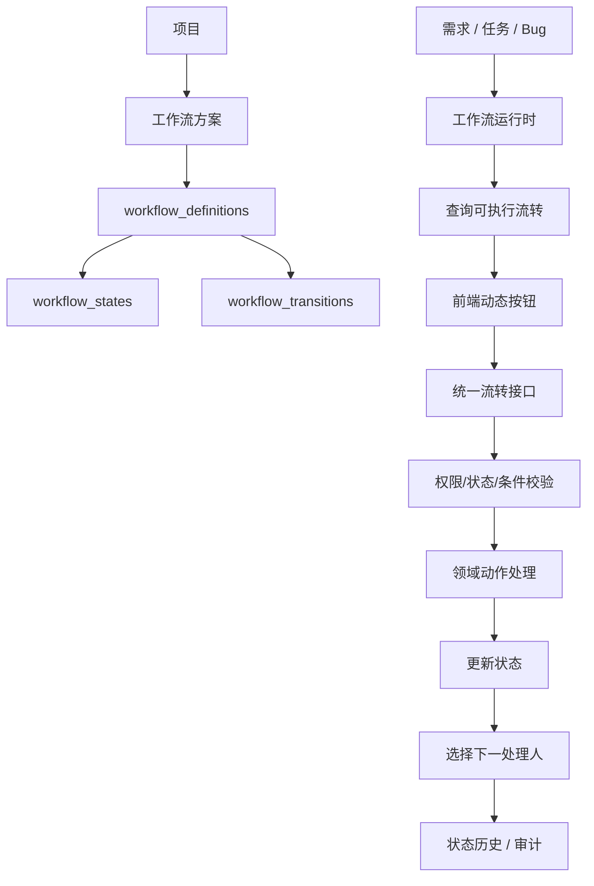

# 动态工作流运行时 PRD

## 1. 背景

当前系统已经支持可视化配置工作流方案，工作流中可以维护状态节点、流转线、动作编码、动作名称和处理人规则。但业务页面上的状态流转按钮仍有较多硬编码，后端也仍通过需求、任务、Bug 各自的固定接口执行状态变更。

这导致工作流配置和实际执行之间存在割裂：

- 工作流中修改 `action_name` 后，页面按钮名称不会自动变化。
- 工作流中新增或禁用某条流转后，页面按钮不会完全同步。
- 后端状态变更仍依赖固定接口，不能完全由工作流定义驱动。
- 处理人规则已经可配置，但状态流转和按钮展示还没有完全运行时化。

本 PRD 目标是建设统一的动态工作流运行时，让需求、任务、Bug 的流转按钮、流转校验、状态变更和下一处理人选择都以项目绑定的工作流方案为准。

## 2. 目标

1. 前端状态流转按钮由工作流流转线动态生成。
2. 按钮名称由 `workflow_transitions.action_name` 决定。
3. 后端提供统一状态流转接口，按工作流定义校验并执行。
4. 需求、任务、Bug 共享同一套运行时能力。
5. 保留必要的领域业务校验和副作用，例如 Bug 解决方案、需求验证、延期转迭代。
6. 状态历史和审计记录继续完整保留。
7. 旧的固定状态流转接口逐步废弃，不一次性强删。

## 3. 非目标

- 不把新增、编辑、删除、导入、建任务、建用例、提 Bug 这类普通功能按钮纳入工作流控制。
- 不在第一阶段实现完整脚本化自动化引擎。
- 不要求一次性删除现有需求、任务、Bug 的固定动作接口。
- 不引入复杂 BPMN 引擎。

## 4. 适用对象

第一阶段适用于以下对象：

| 对象 | object_type |
|---|---|
| 需求 | `requirement` |
| 任务 | `task` |
| Bug | `bug` |

阶段范围确认：

- 第一阶段需求、任务、Bug 同时切换到动态工作流运行时，不做单对象试点。
- 用例不参与本次动态工作流状态流转。
- 测试执行记录不参与本次动态工作流状态流转。
- 用例继续作为测试资产管理，保留创建、编辑、删除、关联需求、被迭代引用、执行、失败提 Bug 等能力。
- 用例执行结果仍可影响需求验证状态，例如执行失败触发需求验证失败，全部通过或忽略后触发需求验证通过。
- 后续如需管理用例生命周期，应单独设计“用例生命周期/测试资产治理”，不混入本次需求、任务、Bug 工作项流转。

不纳入第一阶段的对象：

| 对象 | 是否参与本次动态状态流转 | 说明 |
|---|---|---|
| 用例 | 否 | 测试资产，不作为工作项处理流转对象 |
| 测试执行记录 | 否 | 执行结果记录，不作为状态流转对象 |
| 测试单 | 否 | 后续如需要再单独设计 |
| 迭代 | 否 | 暂保留现有迭代开始/结束逻辑 |
| 项目 | 否 | 暂保留现有项目生命周期逻辑 |

后续可扩展到测试单、迭代、项目等对象。

## 5. 核心概念

| 概念 | 说明 |
|---|---|
| 工作流方案 | 项目绑定的一套工作流配置 |
| 工作流定义 | 某一对象类型的状态和流转定义 |
| 状态节点 | 对象可处于的状态 |
| 流转线 | 从一个状态到另一个状态的动作定义 |
| 动作编码 | 系统识别用的稳定编码，例如 `resolve` |
| 动作名称 | 用户看到的按钮名称，例如“解决” |
| 运行时 | 根据对象当前状态和工作流定义计算可执行动作，并执行流转 |
| 领域动作 | 有特殊业务逻辑的动作，例如 Bug 解决、需求提交验证 |

## 6. 总体方案



## 7. 前端需求

### 7.1 动态流转按钮

需求、任务、Bug 的详情页和列表页不再硬编码状态流转按钮。

页面加载对象后，根据对象类型和对象 ID 调用运行时接口获取可执行流转：

```http
GET /api/v1/workflow-runtime/{object_type}/{object_id}/transitions
```

前端按返回结果渲染按钮：

| 字段 | 用途 |
|---|---|
| `action_key` | 点击后提交的动作编码 |
| `action_name` | 按钮显示文本 |
| `button_type` | 按钮样式 |
| `requires_form` | 是否需要弹表单 |
| `form_schema` | 动态表单字段 |
| `confirm_required` | 是否需要确认 |
| `sort_order` | 按钮排序 |

### 7.2 固定功能按钮

以下按钮继续由页面控制，不纳入工作流：

| 按钮 | 是否纳入工作流 |
|---|---|
| 新增 | 否 |
| 编辑 | 否 |
| 删除 | 否 |
| 导入需求 | 否 |
| 生成任务 | 否 |
| 建用例 | 否 |
| 提 Bug | 否 |
| 指派 | 否 |
| 批量指派 | 否 |

以下按钮应由工作流动态生成：

| 按钮示例 | 是否纳入工作流 |
|---|---|
| 激活 | 是 |
| 提交验证 | 是 |
| 验证通过 | 是 |
| 验证失败 | 是 |
| 完成 | 是 |
| 解决 | 是 |
| 挂起 | 是 |
| 关闭 | 是 |

### 7.3 表单弹窗

部分流转需要填写额外信息：

| 对象 | 动作 | 表单字段 |
|---|---|---|
| 需求 | 关闭 | 关闭原因、目标迭代、备注 |
| 需求 | 延期 | 目标迭代、备注 |
| Bug | 解决 | 解决方案、备注 |
| Bug | 验证失败 | 备注 |
| Bug | 激活 | 目标迭代、备注 |
| Bug | 关闭 | 关闭原因、备注 |

表单字段由后端返回的 `form_schema` 驱动。第一阶段可以由后端根据 `object_type + action_key` 内置生成，后续再支持在工作流配置中维护。

### 7.4 列表页批量查询

列表页不能对每一行单独请求一次按钮，应提供批量接口：

```http
POST /api/v1/workflow-runtime/transitions/batch
```

请求：

```json
{
  "items": [
    { "object_type": "requirement", "id": 1 },
    { "object_type": "task", "id": 2 },
    { "object_type": "bug", "id": 3 }
  ]
}
```

列表页按钮展示策略：

- 列表页采用“一个主按钮 + 更多菜单”的动态流转按钮策略。
- 每行最多直接展示 1 个主按钮。
- 其余可执行流转放入“更多”菜单。
- 详情页仍展示全部可执行流转。
- 破坏性动作、低频动作、异常分支动作默认进入“更多”菜单。
- 如果多个动作都配置为主按钮，按 `ui_config.list_priority` 取优先级最高的一个，其余进入“更多”菜单。
- 如果没有动作配置为主按钮，则从可执行动作中按 `ui_config.list_priority` 选择一个作为主按钮。
- `button_type = danger` 的动作默认不作为主按钮，除非显式配置 `list_display = "primary"`。

默认主按钮建议：

| 当前状态 | 主按钮 | 更多 |
|---|---|---|
| 需求 `draft` | 激活 | 关闭 |
| 需求 `active` | 提交验证 | 延期、关闭 |
| 任务 `todo` | 激活 | 关闭 |
| 任务 `doing` | 完成 | 关闭 |
| Bug `open` | 确认 | 挂起、关闭 |
| Bug `fixing` | 解决 | 挂起 |
| Bug `verifying` | 验证通过 | 验证失败 |
| Bug `closed` | 激活 | - |

返回：

```json
{
  "items": [
    {
      "object_type": "bug",
      "id": 3,
      "transitions": []
    }
  ]
}
```

## 8. 后端需求

### 8.1 查询可执行流转

接口：

```http
GET /api/v1/workflow-runtime/{object_type}/{object_id}/transitions
```

后端处理逻辑：

1. 根据 `object_type` 获取对应对象。
2. 获取对象所属项目。
3. 获取项目绑定的工作流方案。
4. 获取该方案下对应对象类型的启用工作流定义。
5. 根据对象当前 `status` 查询 `from_status = 当前状态` 的启用流转。
6. 过滤当前用户无权执行的流转。
7. 返回按钮展示配置和表单配置。

响应示例：

```json
[
  {
    "action_key": "resolve",
    "action_name": "解决",
    "from_status": "fixing",
    "to_status": "verifying",
    "button_type": "success",
    "requires_form": true,
    "confirm_required": false,
    "sort_order": 100,
    "form_schema": [
      {
        "field": "resolution",
        "label": "解决方案",
        "type": "select",
        "required": true,
        "options": ["已解决", "无法重现", "不予解决", "延期处理"]
      },
      {
        "field": "remark",
        "label": "备注",
        "type": "textarea",
        "required": false
      }
    ]
  }
]
```

### 8.2 执行统一流转

接口：

```http
POST /api/v1/workflow-runtime/{object_type}/{object_id}/transition
```

请求：

```json
{
  "action_key": "resolve",
  "payload": {
    "resolution": "已解决",
    "remark": "修复完成"
  },
  "next_owner_id": null
}
```

后端处理逻辑：

1. 根据 `object_type` 获取对象。
2. 校验对象未删除。
3. 校验当前用户是否为当前处理人。
4. 获取项目绑定的工作流方案。
5. 获取对象类型对应工作流定义。
6. 查找 `from_status = 对象当前状态` 且 `action_key = 请求动作` 的启用流转。
7. 校验 `allowed_roles`。
8. 执行 `validator_config`。
9. 执行领域动作处理。
10. 更新对象状态为 `to_status`。
11. 根据处理人规则计算下一处理人。
12. 写入 `status_operation_log`。
13. 必要时写入 `audit_log`。
14. 返回更新后的对象。

### 8.3 领域动作处理

统一流转接口不能只做简单状态更新。以下动作需要专门处理：

| 对象 | 动作 | 特殊逻辑 |
|---|---|---|
| 需求 | `submit_validation` | 关联任务必须全部完成或关闭 |
| 需求 | `validation_passed` | 关联用例必须全部通过或忽略 |
| 需求 | `validation_failed` | 由用例失败或阻塞触发 |
| 需求 | `defer` | 需求、关联任务、关联用例同步转迭代或游离 |
| 任务 | `complete` | 写完成历史 |
| Bug | `resolve` | 必须填写解决方案，写 `resolved_by`、`resolve_time` |
| Bug | `verify_passed` | 关联用例必须通过或忽略 |
| Bug | `verify_failed` | 写验证失败信息，增加 `reopen_count` |
| Bug | `activate` | 关闭 Bug 激活，原迭代关闭时允许选择新迭代或游离 |
| Bug | `start_fixing` | 可选择未结束迭代 |

建议实现领域动作注册表：

```python
DOMAIN_ACTION_HANDLERS = {
    "requirement.submit_validation": submit_requirement_validation_handler,
    "requirement.validation_passed": requirement_validation_passed_handler,
    "requirement.defer": defer_requirement_handler,
    "bug.resolve": resolve_bug_handler,
    "bug.verify_passed": verify_bug_passed_handler,
    "bug.verify_failed": verify_bug_failed_handler,
    "bug.activate": activate_bug_handler,
}
```

没有注册的动作走通用状态更新。

## 9. 处理人规则

### 9.1 自动处理人选择

每条 `workflow_transition` 可配置 `handler_rule`：

```json
{
  "target_type": "project_role",
  "target_roles": "test_lead,tester",
  "fallback_type": "keep_current",
  "fallback_roles": ""
}
```

支持的 `target_type`：

| 类型 | 说明 |
|---|---|
| `project_role` | 按项目角色选择成员 |
| `keep_current` | 保持当前处理人 |
| `proposer` | 需求提出人 |
| `reporter` | Bug 报告人 |
| `last_resolver` | Bug 最近解决人 |
| `none` | 无处理人，进入待认领 |

当 `project_role` 对应多个角色、多个用户时：

1. 按 `target_roles` 中配置的角色顺序查找。
2. 每个角色内按项目成员 `sort_order asc, id asc` 取第一个。
3. 找不到则执行兜底策略。

### 9.2 手动选择下一处理人

部分流转允许用户手动选择下一处理人。

建议在流转配置中增加：

```json
{
  "allow_manual_owner": true,
  "manual_owner_roles": "tester,test_lead"
}
```

规则：

1. 流转未开启 `allow_manual_owner` 时，忽略前端传入的 `next_owner_id`。
2. 开启后，后端必须校验 `next_owner_id` 是项目成员。
3. 如果配置了 `manual_owner_roles`，还必须校验该成员拥有其中任一项目角色。
4. 未手动选择时，继续按 `handler_rule` 自动计算。

## 10. 数据模型调整

当前 `workflow_transitions` 已有：

- `action_key`
- `action_name`
- `from_status`
- `to_status`
- `allowed_roles`
- `handler_rule`
- `trigger_config`
- `condition_config`
- `validator_config`
- `post_action_config`
- `enabled`
- `sort_order`

确认本次新增：

| 字段 | 类型 | 说明 |
|---|---|---|
| `ui_config` | JSON | 按钮样式、确认提示、排序等 UI 配置 |
| `form_config` | JSON | 动态表单字段配置 |

新增原因：

- `ui_config` 只表达前端展示，不参与业务状态判断。
- `form_config` 只表达用户输入表单，不参与工作流触发逻辑。
- `trigger_config`、`condition_config`、`validator_config`、`post_action_config` 继续用于执行逻辑。
- 展示配置、表单配置、执行配置分离，避免后续维护混乱。

`ui_config` 示例：

```json
{
  "button_type": "success",
  "confirm_required": false,
  "confirm_message": "",
  "button_icon": "",
  "visible_in_list": true,
  "visible_in_detail": true,
  "list_display": "primary",
  "list_priority": 100,
  "show_when_disabled": false,
  "disabled_reason": "",
  "sort_order": 100
}
```

`ui_config` 字段说明：

| 字段 | 说明 |
|---|---|
| `button_type` | 按钮样式，映射前端组件库类型，例如 primary/success/warning/danger/info |
| `button_icon` | 按钮图标，可为空 |
| `confirm_required` | 点击后是否需要二次确认 |
| `confirm_title` | 确认弹窗标题 |
| `confirm_message` | 确认弹窗内容 |
| `visible_in_list` | 是否在列表页展示 |
| `visible_in_detail` | 是否在详情页展示 |
| `list_display` | 列表页展示方式：`primary` 主按钮、`more` 更多菜单、`hidden` 隐藏 |
| `list_priority` | 列表页按钮优先级，数字越小越优先 |
| `show_when_disabled` | 无权限或条件不满足时是否灰显展示 |
| `disabled_reason` | 灰显原因 |
| `sort_order` | 同状态多个按钮时的展示顺序 |

`form_config` 示例：

```json
{
  "fields": [
    {
      "field": "resolution",
      "label": "解决方案",
      "type": "select",
      "required": true,
      "options_source": "bug_resolutions"
    }
  ]
}
```

`form_config` 字段说明：

| 字段 | 说明 |
|---|---|
| `title` | 弹窗标题 |
| `submit_text` | 提交按钮文案 |
| `fields` | 表单字段列表 |
| `field` | 提交给后端的字段名 |
| `label` | 表单标签 |
| `type` | 字段类型 |
| `required` | 是否必填 |
| `placeholder` | 输入提示 |
| `default_value` | 默认值 |
| `options` | 固定选项 |
| `options_source` | 动态选项来源 |
| `max_length` | 文本长度限制 |
| `visible_when` | 条件显示 |
| `required_when` | 条件必填 |

第一阶段必须新增 `workflow_transitions.ui_config` 和 `workflow_transitions.form_config` 两个 JSON 字段，不复用 `trigger_config` 或 `post_action_config`。

## 11. 权限规则

查询和执行流转时都要做权限判断。

流转权限以项目级权限矩阵为前置约束，矩阵定义见 `docs/prd/2026-07-03-workflow-scheme-project-binding-prd.md` 的“8.2 项目级权限矩阵”和“8.3 权限点拆分”。本 PRD 只定义需求、任务、Bug 在动态工作流运行时中的具体流转校验。

### 11.1 当前处理人限制

默认规则：

- 对象有 `owner_id` 时，只有当前处理人可执行状态流转。
- 对象无 `owner_id` 时，不能直接执行状态流转，需要先认领或由管理员指派。

### 11.2 管理员能力

管理员或项目管理角色可以执行：

- 指派
- 批量指派
- 认领池管理

系统管理员、项目负责人和项目管理角色允许直接执行非本人工作项的状态流转，但该操作视为“代处理”。

代处理规则：

1. 必须填写代处理原因。
2. 后端必须记录实际操作人名称快照。
3. 后端必须记录原当前处理人 ID 和名称快照。
4. 状态历史中必须明确标记该操作为代处理。
5. 前端历史展示必须能直接看出“谁代替谁处理，以及为什么代处理”。

对象无当前处理人时，管理员和项目负责人可以直接执行状态流转，该操作也按代处理记录；普通用户仍需先认领或被指派。

### 11.3 角色限制

`workflow_transitions.allowed_roles` 用于限制哪些项目角色可执行某条流转。

如果为空，表示不额外限制项目角色，只校验当前处理人。

## 12. 状态历史和审计

每次统一流转都必须写入 `status_operation_log`：

| 字段 | 说明 |
|---|---|
| `object_type` | requirement/task/bug |
| `object_id` | 对象 ID |
| `action` | `action_key` |
| `from_status` | 原状态 |
| `to_status` | 目标状态 |
| `actor_id` | 操作人账号 ID，仅用于系统关联和审计追溯 |
| `actor_name` | 操作人名称快照，前端历史展示以该字段为准 |
| `is_delegated` | 是否代处理 |
| `delegated_owner_id` | 被代处理的原当前处理人 ID |
| `delegated_owner_name` | 被代处理的原当前处理人名称快照 |
| `delegate_reason` | 代处理原因 |
| `payload` | 表单数据 |
| `remark` | 备注 |

历史记录必须固化操作人名称快照。`actor_id` 不作为业务用户阅读历史的主要字段，前端历史记录统一展示 `actor_name`。即使用户后续改名、禁用或与域账号解绑，历史记录仍显示当时的操作人名称。

代处理历史展示示例：

```text
2026-07-03 10:30，项目经理A 代处理 开发B 的 Bug，执行“验证通过”。原因：线上紧急发布验证。
```

处理人变化时，继续写入 `auto_assign` 操作历史。

涉及关键字段变化时，写入 `audit_log`。

## 13. 兼容和迁移

### 13.1 第一阶段

- 新增工作流运行时查询接口和执行接口。
- 需求、任务、Bug 详情页同时切换为动态按钮。
- 项目详情列表页、工作台列表页同步接入批量查询接口，展示动态流转按钮。
- 用例、测试执行记录不接入动态状态流转。
- 旧需求、任务、Bug 固定动作接口保留。

### 13.2 第二阶段

- 旧固定按钮从前端移除。
- 旧固定动作接口内部改为调用统一运行时，保证外部兼容。

### 13.3 第三阶段

- 旧固定动作接口标记 deprecated，并在确认无外部依赖后删除。
- 迁移旧 `workflow_rules` 关闭联动逻辑。
- 删除不再使用的旧工作流执行引擎。

## 14. 默认工作流映射

### 14.1 需求

| from | action_key | action_name | to | 默认处理人 |
|---|---|---|---|---|
| `draft` | `activate` | 激活 | `active` | 开发负责人/开发 |
| `active` | `submit_validation` | 提交验证 | `pending_validation` | 测试负责人/测试 |
| `pending_validation` | `validation_failed` | 验证失败 | `validation_failed` | 开发负责人/开发 |
| `validation_failed` | `activate` | 重新激活 | `active` | 开发负责人/开发 |
| `pending_validation` | `validation_passed` | 验证通过 | `done` | 保持当前处理人 |
| `active` | `close` | 关闭 | `closed` | 保持当前处理人 |
| `active` | `defer` | 延期 | `draft` | 保持当前处理人 |

### 14.2 任务

| from | action_key | action_name | to | 默认处理人 |
|---|---|---|---|---|
| `todo` | `activate` | 激活 | `doing` | 开发负责人/开发 |
| `doing` | `complete` | 完成 | `done` | 保持当前处理人 |
| `todo` | `close` | 关闭 | `closed` | 保持当前处理人 |
| `doing` | `close` | 关闭 | `closed` | 保持当前处理人 |

### 14.3 Bug

| from | action_key | action_name | to | 默认处理人 |
|---|---|---|---|---|
| `open` | `start_fixing` | 确认 | `fixing` | 开发负责人/开发 |
| `reopened` | `start_fixing` | 确认 | `fixing` | 开发负责人/开发 |
| `suspended` | `start_fixing` | 确认 | `fixing` | 开发负责人/开发 |
| `fixing` | `resolve` | 解决 | `verifying` | 测试负责人/测试 |
| `verifying` | `verify_passed` | 验证通过 | `closed` | 保持当前处理人 |
| `verifying` | `verify_failed` | 验证失败 | `reopened` | 最近解决人，兜底开发 |
| `open` | `suspend` | 挂起 | `suspended` | 保持当前处理人 |
| `fixing` | `suspend` | 挂起 | `suspended` | 保持当前处理人 |
| `reopened` | `suspend` | 挂起 | `suspended` | 保持当前处理人 |
| `suspended` | `activate` | 激活 | `open` | 开发负责人/开发 |
| `closed` | `activate` | 激活 | `reopened` | 最近解决人，兜底开发 |
| `open` | `close` | 关闭 | `closed` | 保持当前处理人 |
| `suspended` | `close` | 关闭 | `closed` | 保持当前处理人 |

## 15. 验收标准

1. 修改工作流流转线的 `action_name` 后，页面按钮名称同步变化。
2. 禁用某条流转线后，对象处于对应状态时不再展示该按钮。
3. 新增一条同状态下的流转线后，页面可展示新按钮。
4. 点击动态按钮后，后端按工作流定义校验 `from_status` 和 `action_key`。
5. 非当前处理人不能执行普通状态流转；管理员、项目负责人和项目管理角色可代处理，但必须填写原因并写入代处理历史。
6. 流转后对象状态更新为配置的 `to_status`。
7. 流转后下一处理人按 `handler_rule` 正确计算。
8. 需要表单的动作能正确弹窗、校验和提交。
9. 状态历史记录完整，且前端展示操作人名称，不展示操作人 ID。
10. 代处理历史必须展示实际操作人、原当前处理人和代处理原因。
11. 旧固定接口在迁移期仍可用。

## 16. 待确认问题

无。
