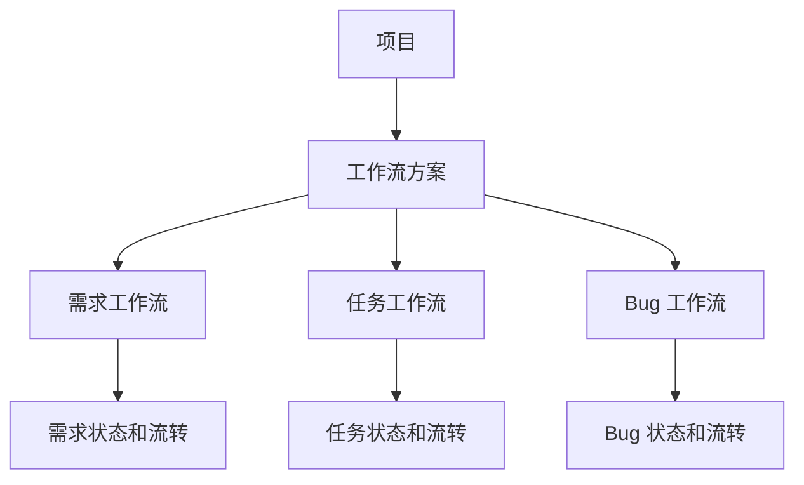

# 工作流方案与项目绑定 PRD

## 1. 背景

当前系统已经支持可视化工作流，并且同一套配置内可以分别维护需求、任务、Bug 等不同对象类型的流程图。该结构与 Jira 的 Workflow Scheme 类似：项目不直接绑定某一张单独的工作流图，而是绑定一套工作流方案；方案内部再按对象类型配置不同工作流。

为避免“工作流规则”“责任人规则”“项目工作流”概念混用，需要统一产品语义和项目绑定入口。

## 2. 目标

- 将用户侧概念统一为“工作流方案”。
- 项目详情配置页作为项目绑定工作流方案的主入口。
- 工作流方案详情页保留项目关联管理能力，用于查看影响范围和批量调整。
- 保留现有后端技术字段，第一阶段不做数据库字段迁移。

## 3. 核心概念

| 概念 | 说明 | Jira 类比 |
|---|---|---|
| 工作流 | 某个对象类型的状态和流转图，例如需求工作流、任务工作流、Bug 工作流 | Workflow |
| 工作流方案 | 一套对象类型到工作流的配置集合 | Workflow Scheme |
| 对象类型 | 需求、任务、Bug，后续可扩展用例、测试单 | Issue Type / Work Type |
| 项目 | 绑定一个工作流方案，项目下工作项按方案执行状态流转和处理人流转 | Project |

## 4. 设计原则

1. 项目绑定方案，而不是绑定单张工作流图。
2. 工作流方案是状态流转和处理人流转的统一配置容器。
3. 项目详情页负责单项目配置，工作流方案页负责方案影响范围管理。
4. 前端展示不再出现“责任人规则配置”作为用户概念。
5. 短期保留 `assignee_rule_config_id` 作为技术字段，前端统一展示为“工作流方案”。

## 5. 信息架构

## 6. 页面入口

### 6.1 项目详情配置页

项目详情配置页是项目绑定工作流方案的主入口。

需要提供：

- 当前项目使用的工作流方案。
- 可切换为其他启用中的工作流方案。
- 可清空工作流方案，清空后项目使用系统默认策略或进入未配置状态。
- 切换方案时记录项目操作历史。

推荐字段：

| 字段 | 说明 |
|---|---|
| 工作流方案 | 下拉选择，展示启用中的方案 |
| 当前方案说明 | 展示方案描述，帮助用户判断适用场景 |
| 影响提示 | 提示切换后新发生的状态流转按新方案执行 |

### 6.2 项目新增/编辑弹窗

项目新增/编辑弹窗提供轻量入口。

需要提供：

- “工作流方案”下拉。
- 允许为空。
- 保存后写入项目绑定字段。

该入口只做快速配置，不展示复杂影响分析。

### 6.3 工作流方案详情页

工作流方案详情页继续保留项目关联管理能力，但定位为方案影响范围管理。

需要提供：

- 已关联项目列表。
- 未配置工作流方案的项目列表。
- 将未配置项目批量关联到当前方案。
- 将已关联项目切换到其他方案。
- 取消项目与当前方案的关联。

工作流方案详情页不替代项目详情配置页。它用于管理员或项目负责人从方案视角查看“哪些项目正在使用这套方案”。

## 7. 交互规则

### 7.1 项目绑定方案

- 一个项目同一时间只能绑定一个工作流方案。
- 多个项目可以共用同一个工作流方案。
- 子项目默认不强制继承父项目方案。
- 新建子项目时可以默认带入父项目方案，但用户可修改。
- 项目未绑定方案时，系统可以使用默认方案或按无方案策略处理，具体由后续默认策略 PRD 定义。

### 7.2 切换方案

切换项目工作流方案时：

- 不批量修改已有需求、任务、Bug 的当前状态。
- 不自动迁移历史记录。
- 新发生的状态流转、处理人流转按新方案计算。
- 历史记录中需要记录原方案和新方案。

历史记录展示示例：

> 由 张三 修改了工作流方案，旧值为“标准研发流程”，新值为“运维支持流程”。

### 7.3 取消关联

取消项目与方案关联时：

- 项目进入“未配置工作流方案”状态。
- 已有工作项状态不变。
- 后续流转按默认策略或阻断策略处理。
- 需要记录历史。

## 8. 权限规则

允许操作工作流方案绑定的角色：

- 系统管理员。
- 项目负责人。
- 具有工作流配置权限的项目成员。

普通当前处理人不能修改项目绑定的工作流方案。

### 8.1 项目负责人边界

项目负责人必须保留，但其含义是“项目管理责任人”，不是项目下需求、任务、Bug 的默认当前处理人。

项目负责人用于：

- 维护项目基础配置、成员和工作流方案。
- 对项目整体交付、范围、风险和配置负责。
- 接收项目级通知、超时升级和无人处理提醒。
- 在团队视图中查看项目范围工作项，并按权限进行指派。

项目负责人不用于：

- 自动进入项目下所有工作项的个人工作台。
- 默认拥有推进任意需求、任务、Bug 状态的权限。
- 替代需求、任务、Bug 的当前处理人。
- 作为工作流方案的唯一处理人分配来源。

工作台仍然按“当前处理人”和“待分派”展示，不因为用户是项目负责人而把项目下所有工作项放入其个人待办。

### 8.2 项目级权限矩阵

权限以项目为主体判断。项目角色只表达用户在该项目内的身份，不直接等同于全局权限。需求、任务、Bug 的日常操作权由“当前处理人”决定；项目负责人负责项目管理、规划、分派和必要的代处理；系统管理员负责平台级兜底。

| 权限项 | 系统管理员 | 项目负责人 | 项目成员 | 当前处理人 |
|---|---|---|---|---|
| 查看项目 | 是 | 是 | 是 | 是 |
| 编辑项目基础信息 | 是 | 是 | 否 | 否 |
| 关闭/归档项目 | 是 | 是 | 否 | 否 |
| 删除项目 | 是 | 否 | 否 | 否 |
| 管理项目成员 | 是 | 是 | 否 | 否 |
| 调整成员项目角色 | 是 | 是 | 否 | 否 |
| 查看项目配置 | 是 | 是 | 可选 | 否 |
| 修改项目工作流方案 | 是 | 是 | 否 | 否 |
| 查看项目历史/审计 | 是 | 是 | 可选 | 当前项相关 |
| 创建迭代 | 是 | 是 | 可选 | 否 |
| 编辑迭代 | 是 | 是 | 可选 | 否 |
| 开始/结束迭代 | 是 | 是 | 否 | 否 |
| 规划工作项到迭代 | 是 | 是 | 可选 | 否 |
| 查看需求 | 是 | 是 | 是 | 是 |
| 创建需求 | 是 | 是 | 是 | 可选 |
| 编辑需求基础信息 | 是 | 是 | 创建人/当前处理人 | 当前处理人 |
| 删除需求 | 是 | 可选 | 否 | 否 |
| 执行需求状态流转 | 是 | 可代处理 | 否 | 是 |
| 指派需求处理人 | 是 | 是 | 可选 | 可选 |
| 批量指派需求 | 是 | 是 | 否 | 否 |
| 查看任务 | 是 | 是 | 是 | 是 |
| 创建任务 | 是 | 是 | 是 | 可选 |
| 编辑任务基础信息 | 是 | 是 | 创建人/当前处理人 | 当前处理人 |
| 删除任务 | 是 | 可选 | 否 | 否 |
| 执行任务状态流转 | 是 | 可代处理 | 否 | 是 |
| 指派任务处理人 | 是 | 是 | 可选 | 可选 |
| 批量指派任务 | 是 | 是 | 否 | 否 |
| 查看 Bug | 是 | 是 | 是 | 是 |
| 创建 Bug | 是 | 是 | 是 | 可选 |
| 编辑 Bug 基础信息 | 是 | 是 | 创建人/当前处理人 | 当前处理人 |
| 删除 Bug | 是 | 可选 | 否 | 否 |
| 执行 Bug 状态流转 | 是 | 可代处理 | 否 | 是 |
| 指派 Bug 处理人 | 是 | 是 | 可选 | 可选 |
| 批量指派 Bug | 是 | 是 | 否 | 否 |
| 查看用例 | 是 | 是 | 是 | 是 |
| 创建用例 | 是 | 是 | 测试成员 | 可选 |
| 编辑用例 | 是 | 是 | 创建人/测试成员 | 否 |
| 删除用例 | 是 | 可选 | 否 | 否 |
| 执行用例 | 是 | 是 | 测试成员 | 当前测试人 |
| 从用例提交 Bug | 是 | 是 | 测试成员 | 当前测试人 |
| 查看工作台 | 是 | 是 | 是 | 是 |
| 查看我的待办 | 是 | 是 | 是 | 是 |
| 查看团队待办 | 是 | 是 | 可选 | 否 |
| 查看待分派/待规划池 | 是 | 是 | 可选 | 否 |
| 认领待分派工作项 | 是 | 是 | 是 | 是 |
| 自动分配工作项 | 是 | 是 | 否 | 否 |
| 超时提醒配置 | 是 | 是 | 否 | 否 |

矩阵说明：

- “可选”默认不开放，由项目权限模板或后续权限配置开启。
- “当前处理人”是动态身份，不是项目角色。用户只有在某条需求、任务、Bug 的当前处理人等于自己时，才获得该记录的状态流转操作权。
- “可代处理”必须写入历史，记录实际操作人、原当前处理人、代处理原因和操作时间。
- 项目负责人可以看全部、分派全部、规划全部，但不应绕过审计直接修改历史或硬删除业务数据。
- 系统管理员可以执行兜底操作，但平台应优先鼓励项目负责人在项目内完成管理闭环。

### 8.3 权限点拆分

第一版可以先将权限点内置到后端判断中，后续再做可配置权限模板。权限点建议如下：

| 权限点 | 说明 |
|---|---|
| `project.view` | 查看项目及项目内数据 |
| `project.edit` | 编辑项目基础信息 |
| `project.close` | 关闭或归档项目 |
| `project.delete` | 删除项目 |
| `project.manage_members` | 管理项目成员和项目角色 |
| `project.workflow_config` | 修改项目绑定的工作流方案 |
| `iteration.manage` | 创建、编辑、开始、结束迭代 |
| `work_item.create` | 创建需求、任务、Bug |
| `work_item.edit` | 编辑工作项基础字段 |
| `work_item.transition` | 执行需求、任务、Bug 状态流转 |
| `work_item.assign` | 指派单个工作项当前处理人 |
| `work_item.batch_assign` | 批量指派当前处理人 |
| `work_item.admin_action` | 管理员或项目负责人代处理 |
| `work_item.delete` | 删除工作项 |
| `test_case.manage` | 创建、编辑、删除测试用例 |
| `test_case.execute` | 执行测试用例并提交 Bug |
| `audit.view` | 查看项目或工作项历史审计 |

权限判断推荐顺序：

1. 判断用户是否具备项目可见权限。
2. 判断用户是否具备对象可见权限。
3. 判断对象当前状态和工作流流转是否允许该动作。
4. 判断当前用户是否为当前处理人。
5. 如果不是当前处理人，判断是否具备 `work_item.admin_action`。
6. 如果是代处理，要求填写原因并写入代处理历史。

## 9. 数据设计

第一阶段不做字段迁移。

继续使用：

| 表 | 字段 | 用户侧语义 |
|---|---|---|
| `projects` | `assignee_rule_config_id` | 工作流方案 ID |
| `assignee_rule_configs` | `id` | 工作流方案 ID |
| `workflow_definitions` | `scope_id` | 工作流方案 ID |

后续可考虑迁移命名：

| 当前字段/表 | 目标命名 |
|---|---|
| `assignee_rule_configs` | `workflow_schemes` |
| `projects.assignee_rule_config_id` | `projects.workflow_scheme_id` |
| `workflow_definitions.scope_type = assignee_rule_config` | `workflow_definitions.scope_type = workflow_scheme` |

迁移不是第一阶段范围，避免影响现有接口和数据。

## 10. API 设计

第一阶段复用现有接口：

| 场景 | 接口 |
|---|---|
| 查询工作流方案 | `GET /api/v1/assignee-rule-configs` |
| 创建工作流方案 | `POST /api/v1/assignee-rule-configs` |
| 修改工作流方案 | `PATCH /api/v1/assignee-rule-configs/{id}` |
| 停用工作流方案 | `DELETE /api/v1/assignee-rule-configs/{id}` |
| 项目绑定/切换方案 | `PATCH /api/v1/projects/{id}`，传 `assignee_rule_config_id` |

后续可新增语义化 API：

| 场景 | 建议接口 |
|---|---|
| 查询工作流方案 | `GET /api/v1/workflow-schemes` |
| 项目切换方案 | `PATCH /api/v1/projects/{id}/workflow-scheme` |

## 11. 前端文案规范

用户界面统一使用：

- 工作流方案
- 方案名称
- 新增方案
- 工作流方案详情
- 已关联项目
- 未配置工作流方案的项目
- 切换到方案

用户界面避免使用：

- 责任人规则
- 责任人规则配置
- 工作流规则列表
- 转移到规则
- 选择目标规则

## 12. 验收标准

- 项目新增/编辑时可以选择工作流方案。
- 项目详情配置页可以查看和切换当前工作流方案。
- 工作流方案详情页可以查看已关联项目。
- 工作流方案详情页可以批量关联未配置方案的项目。
- 工作流方案详情页可以将项目切换到其他方案。
- 工作流方案切换后，项目历史记录展示方案名称，而不是内部 ID。
- 前端用户可见文案不再出现“责任人规则配置”。
- 不影响已有可视化工作流的编辑和保存。

## 13. 非目标

- 本 PRD 不做数据库表和字段重命名。
- 本 PRD 不设计默认方案策略。
- 本 PRD 不设计跨项目方案继承。
- 本 PRD 不处理已有工作项状态与新方案状态不匹配的迁移问题。

## 14. 前端操作可见性与无权限提示

### 14.1 操作按钮可见性

- 前端应根据当前登录用户、项目负责人、项目成员、当前处理人、测试角色、系统角色和后端返回的工作流可执行流转，控制操作按钮是否展示。
- 用户无权限执行的操作不展示按钮，也不放入“更多”菜单。
- 工作流状态流转按钮以 `/workflow-runtime/.../transitions` 返回的可执行流转为准；后端未返回的流转不展示。
- 静态业务按钮需要接入统一权限判断：
  - 项目基础配置、成员、工作流方案、迭代生命周期：系统管理员或项目负责人可见。
  - 删除项目：仅系统管理员可见。
  - 创建需求、任务、Bug：系统管理员、项目负责人或项目成员可见。
  - 编辑需求、任务、Bug：当前处理人、系统管理员或项目负责人可见。
  - 删除需求、任务、Bug：系统管理员或项目负责人可见。
  - 测试用例和测试单管理：系统管理员、项目负责人或测试角色成员可见。
  - 工作流方案配置：仅系统管理员可见。

### 14.2 失败提示

- 前端隐藏按钮只是体验优化，不作为安全边界；所有写操作仍必须以后端权限校验为准。
- 当用户因权限变化、状态并发变化、数据被删除或其他后端校验失败导致操作被拒绝时，前端应使用弹窗提示后端返回的 `detail`，而不是静默失败或只在控制台输出。
- `401`、`403`、`409`、`400` 等写操作失败均应提示用户；如果后端没有返回 `detail`，使用当前业务动作的兜底文案。
- 列表页只展示当前最重要的可执行动作，其他可执行动作放入“更多”；无权限动作不展示。
